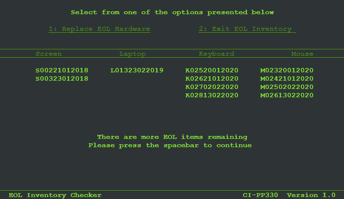
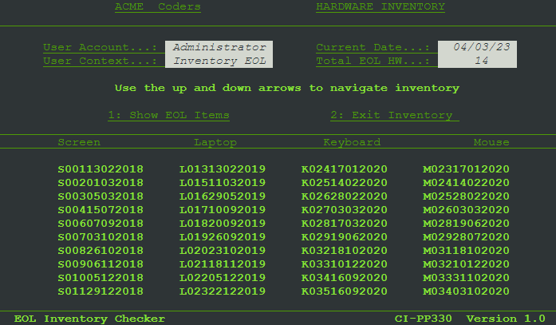

# EOL Checker

### Introduction

EOL Checker is a small program which simulates an IT hardware inventory for a 5 year old company of 50 employees. You log in as the administrator and from there you can view and sscroll through the inventory. You have the option to update any hardware that has reached its end of life cycle.

## Detailed Description

Most of the magic in this program happens under the hood as is usually the case and there are three main aspects to the program.

- Simulation

    The inventory simulation is calculated over a 5 year cylce. 10 random dates are generated for
    the each year and these are ordered in sequence with the first date at the top of the sequence. Then each date is prefixed with a capital letter which is the first letter of the hardware type followed by a 3 digit zero prefixed number.

    In order to simulate a real world scenario the hardware is given an average failure rate and this is simulated by generating a random number between 1 - 3 for the 10 items in each hardware list for the given year. A separate random number is generated for each hardware type. Having generated the random number, a random selection equal to that hardware type's random number is then removed from the list. Finally a new random date which must be later than the removed item's date is generated. A new item is created, again using the capitalised first letter of the hardware type followed by 3 digit zero prefixed ID incremented from the id of the last item in the corresponding hardware type list and the newly created random date is added to the end of the item. This is then appended to the corresponding hardware type list.

    To add another layer of complexity, again simulating a real world type scenario, each hardware type is given an end of life (EOL) value. After the first year has been generated and another year added using the same process as above, each hardware type is checked against its corresponding EOL value. If any of the items in the hardware type lists match this EOL value, then they are removed and a new set or list of items are appended using the same nomenclature as before.

    When the cycle of 5 years is completed the inventory is sent to a google sheet. At this point the columns will each have a heading listing the hardware type, followed by 50 rows of items. The item names will generally follow in order by descending dates and id numbers, but we should see gaps and random changes from the real world type simulation method by which the inventory was generated. Also many changes will be observed for some hardware types which have a short EOL but less so for hardware types with a longer EOL.

- Presentation

    The presentation of the program harks back to the mid to late 20th century heyday of minicomputers and mainframes which used crt terminals which were limited to little more than 2 colours. The look and feel is similiar to something like the VAX or PDP from Digital. Given more time I would have loved to emulate these in a way which would be more true to the original. This will be the plan for a next version.

- Interaction

    There isn't much going on here as most of the magic happens in the simulation but there is some code of very minor complexity used to generate the color palette and the layout. Ideally the screen would be made up of separate areas which would be changed independently of the screen header and footer but it was not possible for me to do this here. Due to this the screen is regenerated in its entirety each time the user chooses an option. Luckily due to the processing power of today's computers this doesn't present an issue and if anything serves to mimic the screen refresing abilities of older 20th century hardware. 

---

# Features

The program allows some basic user interaction.

### Main Screen 
1. Show Inventory. Pressing 1 brings the user to the Inventory display screen.
2. Show EOL Items. Pressing 2 brings the user to the EOL Hardware display screen.
3. Exit Inventory. Pressing 3 is not currently working or fully implemented.

### Inventory Screen

Pressing the up and down arrows allows the user to navigate the inventory.
1. Show EOL Items. Pressing 2 brings the user to the EOL Hardware display screen.
2. Exit Inventory. Pressing 2 brings the user back to the main screen.

### EOL Items Screen

1. Replace EOL Hardware. Pressing 1 will delete a row of data.
2. Exit EOL Inventory. Pressing 2 will return the user to the main screen.

### Error Checking

- Inventory Screen

    If the user presses the up arrow while already at the top of the inventory, or the down arrow when at the end of the inventory, they will receive a message to that effect and will need to press space to continue.

- EOL Items Screen

    When the user attempts to display EOL Items when there are none, or to remove EOL Items when there are none they should get a message to that effect after which they should press the space button to continue. This is not working and in rare cases the message appears alongside the EOL Items as discussed in the Bugs section.

----
## User Experience

- User Stories

    - User Goals

    1. I want to see all the current hardware in the inventory
    2. I want to navigate through the inventory
    3. I want to see what hardware is due to be replaced
    4. I want to replace any hardware which is due to be replaced

---
# Flowcharts

I created a number of flowcharts to help me visualize the program flow and I used Canva for this. The flowcharts changed over time and may not fully follow the final program flow but are shown here to illustrate the course of progress.

---
# Technologies Used

- Language Used

    - Python

---
- Tools Used

    - [Canva] https://www.canva.com/ for flowcharts
    - [PythonTutor] https://pythontutor.com/ for testing code snippets
    - [Chat-GPT] https://chat.openai.com/ as a tutor !!
    - [w3schools] https://www.w3schools.com/ for reference and guide
    - [Google] https://www.google.com/ for all the things !
    - [Google-Cloud] https://console.cloud.google.com/ for APIs
    - [Google-Sheets] https://docs.google.com/spreadsheets/ for the data
    - [Heroku] https://dashboard.heroku.com/ to host the application
    - [GitHub] https://github.com/ for hosting the repository
    - [GitPod] https://www.gitpod.io/ for writing and testing the code
    - [Visual-Studio] to try debugging code when gitpod could not
    - [Photoshop] To create the VT 100 terminal image at the top of this readme
    - Pen and paper to scribble notes, code, ideas 

    

---

## Bugs and Issues

* GSPREAD 'code': 429, 'message': "Quota exceeded for quota metric 'Write requests' and limit 'Write requests per minute per user' If you attempt to re-run the program again before at least 1 minute has passed since the last time it ran, the program will fail due to a limit on the write requests to google sheets. 

* EOL Hardware screen and menu options are problematic and may cause the program to exit. Unfortunately it was impossible to troubleshoot using the Gitpod debugger because the readchar module causes the debugger to crash. This will need to be manually debugged which was not possible at this point due to time constraints.

    Update: as of 02042023 this issue is somewhat resolved. However the key to replace EOL hardware needs to be pressed once for each row of data so this still needs resolution. In some rare cases the warning that there are no more EOL items appears. When this happens the program is directed to an alert or error catching function which waits for a spacebar to be pressed thereby never allowing the EOL hardware replacement option to be triggered. AS the EOL hardware is generated randomly it is difficult to replicate. This happens randomly for some as of yet unknown reason.

    The *no more EOL items remaining* message should be triggered as well if the user attempts to click EOL hardware when there is no more remaining or when the user tries to display EOL hardware when there is no more remaining but this feature is not working correctly. 
    
    Screen shot of randomly occuring EOL screen issue.

    

    Aditionaly once the EOL items are all replaced the EOL Screen size is displays with the wrong number of rows in the inventory display area.

- Terminal screen issues. I initially set up the screen with a width of 120 characters and a length of 35. This was to allow for 6 hardware types . I modified the code on discovering that the max size was 80 characters by 25 lines. This led to a number of issues and code had to be refactored to allow for the smaller screen size. Reducing the number of hardware types from 6 to 4 was simple enough and didn't affect the simulation in any way as I already had 2 sets of 2 hardware types with equal EOL values so removing 1 of each had no material impact on the siulation. The display area for the inventory was more problematic and had to be altered both to render the inventory but more crucially to correctly detect that the end of the inventory was reached.  Finally, the ansi coloring, while rendering perfectly in Gitpod with excellent contrast and readablity, does not render anywhere near as well on the Heroku terminal unfortunately and time constraints prevented me from adjuting and resolving this. 

    Gitpod and Heroku contrasted side by side

    

* The Exit Inventory option on the main screen menu does not do anything. Although it is coded to break out of the loop this doesn't happen. Again it was impossible to troubleshoot using the Gitpod debugger becuase the readchar module causes the debugger to crash. This will need to be manually debugged which was not possible at this point due to time constraints.

---

## Testing

CI's Python Linter was used to validate the code and all errors and incorrect code were resolved.

## Testing User Stories

1. I want to see all the current hardware in the inventory
    The main screen image shows displays option 1 to *"Show Inventory"*

    

    Result from pressing 1 below

    

2. I want to navigate through the inventory

    Pressing the up and down arrows allows the user to navigate through the inventory. If the user presses the up arrow when at the top of or at the bottom of the inventory they will
    receive a message to that effect and are prompted to press *Space* to return.

    Prompt message if exceeding inventory range

    

3. I want to see what hardware is due to be replaced

    The user can access the EOL hardware display from both the main screen by pressing 2 or from the Inventory Screen by pressing 2 

    

4. I want to replace any hardware which is due to be replaced

    The user can press 1 to Replace Eol Hardware. The user will press 1 until the screen is clear of all EOL hardware entires.

    

---

## Cloning the eol_checker repository from Git Hub

You may clone this repository in order to run it from your own Git Hub workspace. To do so follow the procedure outlined below.

- Click on the Code button and then code if not automatically selected

- Click on the *Create codespace on main* which will create a copy of the workspace 

- Read the requirements.txt which nomally tell you what modules you need to install. As you are cloning a workspace most of these will already be installed. You will need to manually install the following modules using *pip3 install* followed by the module name in your terminal window.

    1. readchar
    2. gspread
    3. google auth

    

## Deployment on Heroku

Make sue that you requirements.txt file contains all the modules that you need to run your app.

1. Go to the Heroku website and create an account by filling the details on the form at this link [Heroku Signup](https://id.heroku.com/login)

2. Once you have created your account and set up any additional requirements such as 2FA log in and create your app on Heroku.

3. From the Heroku dashboard, click on the *Create new app* button, give your app a name which has to be unique, select your region and click on the *Create app* button.

4. Next go to *Settings*, look for *Config Vars* and then click on *Reveal Config Vars*. In the *KEY* field type "CREDS" (in capitals). Copy the entire contents onf your *creds.json* file from your Gitpop workspace and paste them into the *VALUE* field. Click the *Add* button. Note: Make sure that your credentials file is named creds.json as otherwise Heroku will not be able to locate it.

5. Locate the *Buildpacks* section and click on *Add buildback*. Ass both "Python" and "Node.js". Make sure that they are listed in the order "Python" followed by "Node.js".

6. Click on the *Deploy* tab at the top of the page and choose GitHub as the deployment method, then scroll down and click on the *Connect to GitHub* button.

7. Search for your repository name by typing the name you gave it into the search box and click *"*Search* button, then click on *Connect* to link up Heroku with your GitHub repository code.

8. Now, scroll down to the "Automatic deploys" section and click the *Enable Automatic Deploys* button so that Heroku can rebuild the app every time a new change is pushed to your code on GitHub. Alternatively set to manual if you prefer.

9. Once the message which says "Your app was successfully deployed" you will see a *View* button which takes you to the deployed link.

10. The program runs automatically when you go tho this link and if you want to reastart it click the *RUN PROGRAM* button at the top left of the page.

Link to Heroku project deployment [eol-checker](https://eol-checker.herokuapp.com/)

Link to GitHub repository [eol-checker](https://github.com/brianach/eol_checker)

---
## Credits

- Girish on Stack Overflow for instrucitons and example code on ANSI terminal coloring
    [ANSI Termainl Text Coloring](https://stackoverflow.com/questions/287871/how-do-i-print-colored-text-to-the-terminal)

- [30 Seconds of Code](https://www.30secondsofcode.org/python/s/days-ago/) for demonstration of of TimeDelta and how to work with dates

## Acknowledgements

- My mentor Naoise Gaffney
- CI once again for providing this educational experience
- My wife Tricia for her support and patience 